Final project: Peer-graded Assignment: Project Submission & Peer Review
================

## **`Task 1: Submit the list of entities that you identified as part of Task1`**

-   1-s​taff

-   2​-sales_outlet

-   3​-sales_transaction

-   4​-customer

-   5​-product

## **`Task 2: Submit the list of attributes that you identified as part of Task 2.`**

1.  Using the information from the sample data in the image from Task 1,
    identify the attributes for the entity that will store the sales
    transaction data.

2.  Make a list of the sales transaction attributes that you identified.

**s​ales_transaction:**

1- transaction_id

2- transaction_date

3- transaction_time

4- sales_outlet_id

5- staff_id

6​- customer_id

7- product_id

8​- quantity

9​- price

## **`Task 3: Create an ERD`**

Now that you have defined some of your attributes and entities, you can
determine the tables and columns for them and create an ERD.

1.  Open a new terminal from the side-by-side Cloud IDE.

2.  Use the `start_postgres` command to start a PostgreSQL service
    session in the Cloud IDE.

3.  Use the pgAdmin weblink to open pgAdmin in a new tab in your
    browser.

4.  Create a new database named `COFFEE`, view the schemas in the new
    `COFFEE` database, and then start a new ERD project.

5.  Add a table to the ERD for the sale transactions entity using the
    information in the following table. Consider what naming convention
    to use so that your colleagues will be able to understand your data
    and to ensure that the names are valid in other RDBMS. And use the
    sample data shown in the image in Task 1 to determine appropriate
    data types for each column.

    

### **Task 3A**: Submit the screenshot that you took as part of Task 3 and saved as Task3A.png or Task3A.jpg

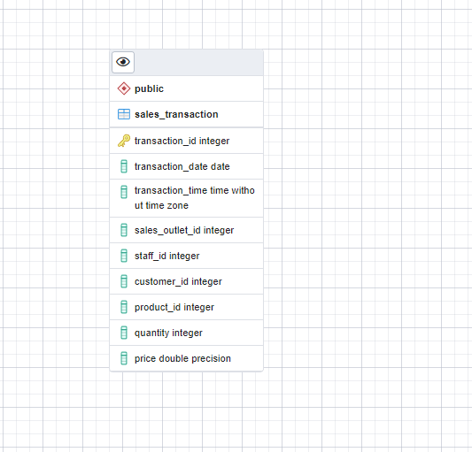

``` sql
-- This script was generated by a beta version of the ERD tool in pgAdmin 4.
-- Please log an issue at https://redmine.postgresql.org/projects/pgadmin4/issues/new if you find any bugs, including reproduction steps.
BEGIN;


CREATE TABLE public.sales_transaction
(
    transaction_id integer NOT NULL,
    transaction_date date,
    transaction_time time without time zone,
    sales_outlet_id integer,
    staff_id integer,
    customer_id integer,
    product_id integer,
    quantity integer,
    price double precision,
    PRIMARY KEY (transaction_id)
);
END;
```

1.  Add a table to the ERD for the product entity using the information
    in the following table. Consider what naming convention to use so
    that your colleagues will be able to understand your data and to
    ensure that the names are valid in other RDBMS. And use the sample
    data shown in the image in Task 1 to determine appropriate data
    types for each column.


### Take a screenshot of your ERD and save it as Task3B.png or Task3B.jpg.

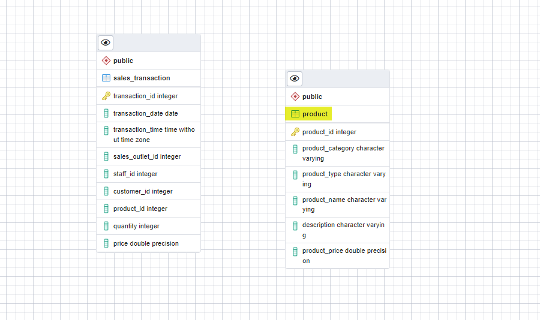

``` sql
-- This script was generated by a beta version of the ERD tool in pgAdmin 4.
-- Please log an issue at https://redmine.postgresql.org/projects/pgadmin4/issues/new if you find any bugs, including reproduction steps.
BEGIN;


CREATE TABLE public.sales_transaction
(
    transaction_id integer NOT NULL,
    transaction_date date,
    transaction_time time without time zone,
    sales_outlet_id integer,
    staff_id integer,
    customer_id integer,
    product_id integer,
    quantity integer,
    price double precision,
    PRIMARY KEY (transaction_id)
);

CREATE TABLE public.product
(
    product_id integer NOT NULL,
    product_category character varying,
    product_type character varying,
    product_name character varying,
    description character varying,
    product_price double precision,
    PRIMARY KEY (product_id)
);
END;
```

## **`Task 4: Normalize tables`**

When reviewing your ERD you notice that it does not conform to second
normal form. In this task, you will normalize some of the tables within
the database.

1.  Review the data in the sales transaction table. Note that the
    transaction id column does not contain unique values because some
    transactions include multiple products.

    Done
    [:white_check_mark:](https://emojipedia.org/check-mark-button/).

2.  Determine which columns should be stored in a separate table to
    remove the repeating rows and to put this table into second normal
    form.

    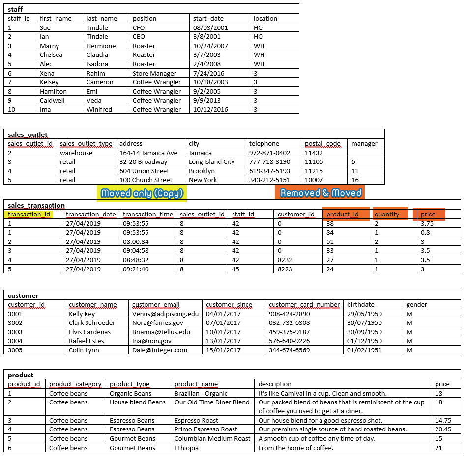

3.  Add a new table named `sales_detail` to the ERD, define the columns
    in the new table, and delete the moved columns from the sales
    transaction table, leaving a matching column in each of two tables
    to later create a relationship between them.

4.  Take a screenshot of your ERD and save it as Task4A.png or
    Task4A.jpg.

    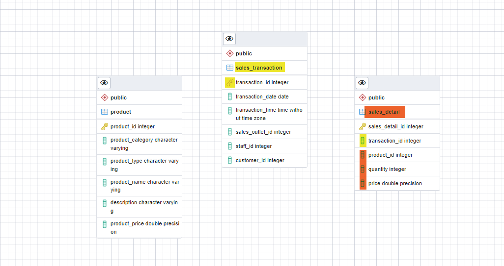

5.  Review the data in the product table. Note that the product category
    and product type columns contain redundant data.

6.  Determine which columns should be stored in a separate table to
    reduce redundant data and to put this table into second normal form.

7.  Add a new table named `product_type` to the ERD, define the columns
    in the new table, and delete the moved columns from the product
    table, , leaving a matching column in each of two tables to later
    create a relationship between them.

8.  Take a screenshot of your ERD and save it as Task4B.png or
    Task4B.jpg.

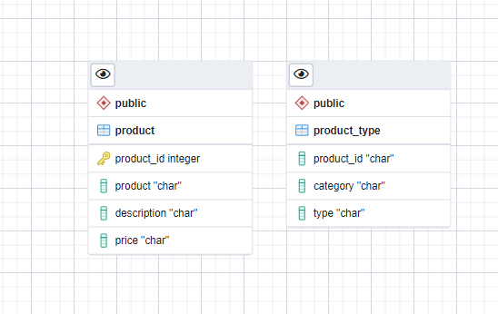

## **`Task 5: Define keys and relationships`**

After normalizing your tables, you can define their primary keys and
define relationships between the tables in your ERD.

1.  Identify an appropriate column in each table to be a primary key and
    create the primary keys in the tables in your ERD.

2.  Take a screenshot of your ERD and save it as Task5A.png or
    Task5A.jpg.

    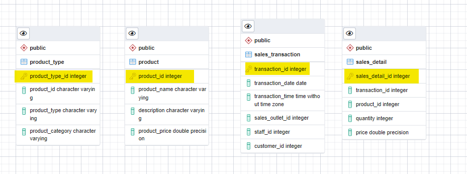

3.  Identify the relationships between the following pairs of tables and
    then create the relationships in your ERD:

    -   `sales_detail` to `sales_transaction`

    -   `sales_detail` to `product`

    -   `product` to `product_type`

4.  Take a screenshot of your ERD and save it as Task5B.png or
    Task5B.jpg.

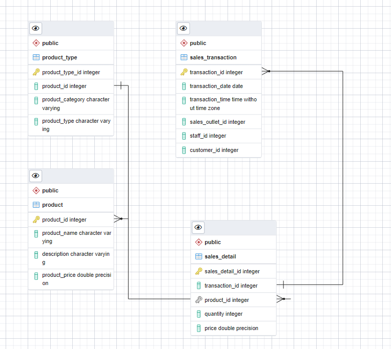

## **`Task 6: Create database objects by generating and running the SQL script from the ERD Tool`**

Now that your design is complete, you will generate an SQL script from
your ERD which you could use to create your database schema. For the
purposes of this project, you will then use a provided SQL script to
ensure that you will be able to successfully load the sample data into
the schema. Finally, you will load the existing data from the various
data sources into your new database schema.

1.  Use the Generate SQL functionality in the ERD Tool to create an SQL
    script from your ERD.

2.  Download the `GeneratedScript.sql` file below to your local computer
    storage.

    -   [GeneratedScript.sql](https://cf-courses-data.s3.us.cloud-object-storage.appdomain.cloud/IBM-DB0110EN-SkillsNetwork/datasets/CoffeeData/GeneratedScript.sql)

3.  In pgAdmin, open the Query Tool, upload and open the
    `GeneratedScript.sql` file from your local computer storage, and
    then execute the script to create the tables defined in the ERD.
    Verify that the tables now exist in the `public` schema of the
    `COFFEE` database.

4.  Take a screenshot of the tables shown in the tree-view pane on the
    left-hand side of the page and save it as Task6A.png or Task6A.jpg.

    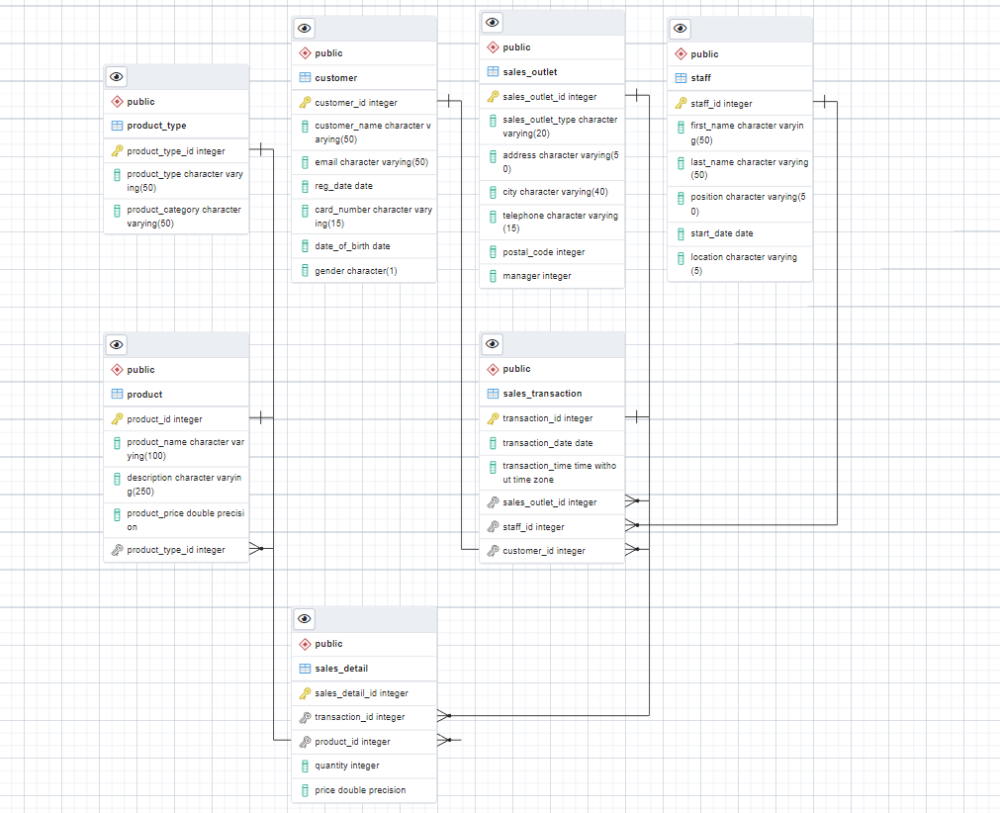

5.  Download the `CoffeeData.sql` file below to your local computer
    storage.

    -   [CoffeeData.sql](https://cf-courses-data.s3.us.cloud-object-storage.appdomain.cloud/IBM-DB0110EN-SkillsNetwork/datasets/CoffeeData/CoffeeData.sql)

6.  In pgAdmin, open another instance of the Query Tool, upload and open
    the `CoffeeData.sql` file from your local computer storage, and then
    execute the script to populate the tables you just created.

7.  In pgAdmin, view the first 100 rows of the `sales_detail` table.

8.  Take a screenshot of the Data Output pane and save it as Task6B.png
    or Task6B.jpg.

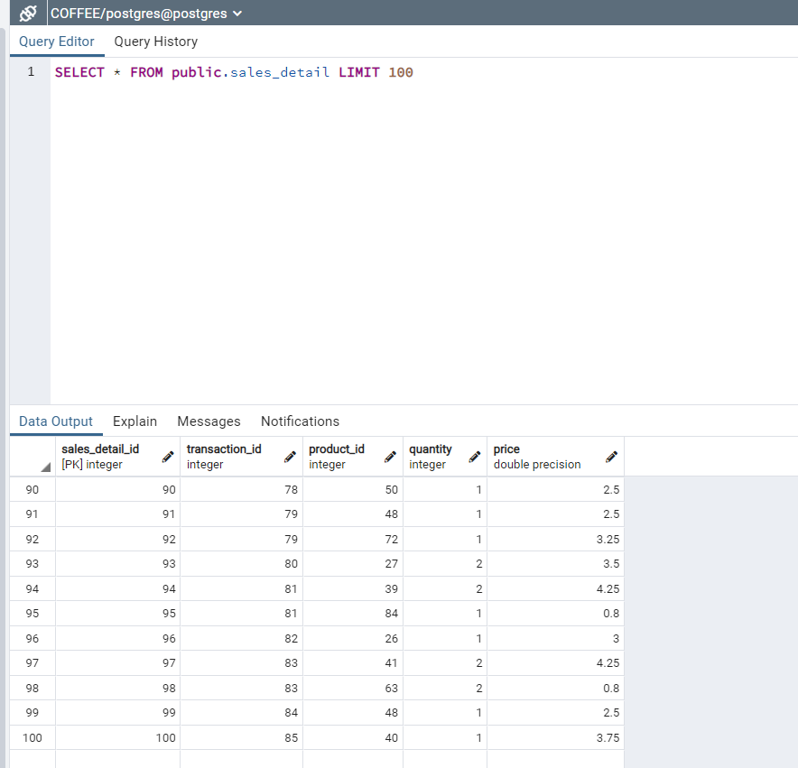

## **`Task 7: Create a view and export the data`**

The external payroll company have requested a list of employees and the
locations at which they work. This should not include the CEO or CFO who
own the company. In this task, you will create a view in your PostgreSQL
database that returns this information and export the results to a CSV
file.

1.  In your `COFFEE` database, create a new view named
    `staff_locations_view` using the following SQL:

        SELECT staff.staff_id,
        staff.first_name,
        staff.last_name,
        staff.location
        FROM staff
        WHERE "position" NOT IN ('CEO', 'CFO');

2.  View all the rows returned from the view.

3.  Save the results of the query to a file named
    `staff_locations_view.csv` on your local computer storage.

4.  Take a screenshot of the view shown in the tree-view pane on the
    left-hand side of the page alongside the results in the Data Output
    pane, and save it as Task7.png or Task7.jpg.

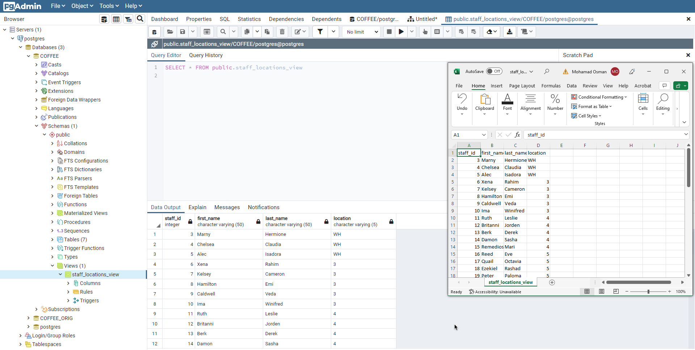

## **`Task 8: Create a materialized view and export the data`**

A marketing consultant requires access to your product data in their
MySQL database for a marketing campaign. You will create a materialized
view in your PostgreSQL database that returns this information and
export the results to a CSV file.

1.  In your `COFFEE` database, create a new materialized view named
    `product_info_m-view` using the following SQL:

        SELECT product.product_name, product.description, product_type.product_category
        FROM product
        JOIN product_type
        ON product.product_type_id = product_type.product_type_id;

2.  Refresh the materialized view with data.

3.  View all the rows returned from the view.

4.  Save the results of the query to a file named
    `product_info_m-view.csv` on your local computer storage.

5.  Take a screenshot of the view shown in the tree-view pane on the
    left-hand side of the page alongside the results in the Data Output
    pane, and save it as Task8.png or Task8.jpg.

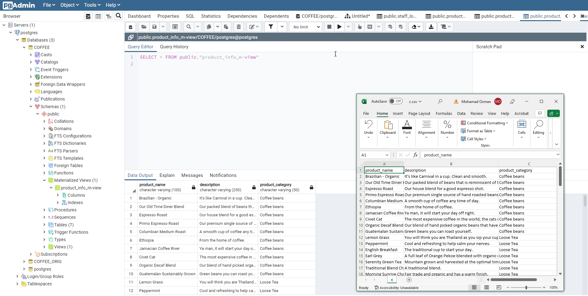

## **`Task 9: Import data into a Db2 database`**

The external payroll company have asked you to upload the staff location
information to their Db2 database.

1.  In a new browser tab, go to <https://cloud.ibm.com/login>, log in
    using your credentials, and then open a console for your Db2 on
    Cloud instance that you created earlier in this course.

2.  Use the Load Data feature to load a new table named
    `STAFF_LOCATIONS` with the staff location information saved in the
    `staff_locations_view.csv` file that you exported from the view you
    created in Task 7.

3.  Explore the new table and then view the data in it.

4.  Take a screenshot of the contents of the new table and save it as
    Task9.png or Task9.jpg.

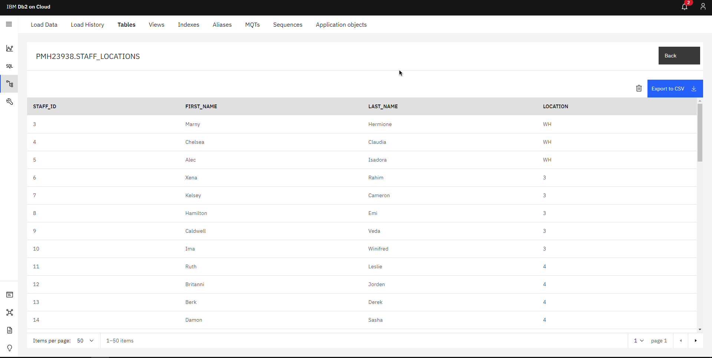

## **`Task 10: Import data into a MySQL database`**

The marketing consultant has asked you to upload the product information
to their MySQL database.

1.  In the terminal from the side-by-side Cloud IDE, use the
    `start_mysql` command to start a My SQL service session in the Cloud
    IDE.

2.  Use the browser weblink to open phpMyAdmin in a new tab in your
    browser.

3.  In phpMyAdmin, create a new database named `coffee_shop_products`,
    and then import the product information saved in the
    `product_info_m-view.csv` file from your materialized view into a
    new table in the `coffee_shop_products` database.

4.  Browse the contents of the new table.

5.  Take a screenshot of the contents of the new table and save it as
    Task10.png or Task10.jpg.


### `The End`
