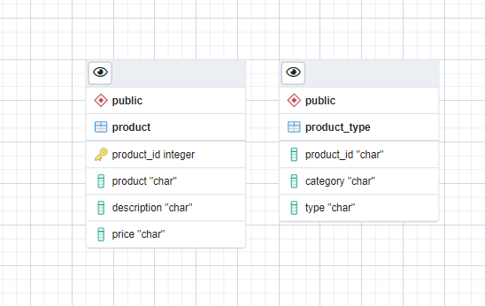

Final project: Peer-graded Assignment: Project Submission & Peer Review
================

## **Task 1**: Submit the list of entities that you identified as part of Task1

-   1-s​taff

-   2​-sales_outlet

-   3​-sales_transaction

-   4​-customer

-   5​-product

### 

## **Task 2**: Submit the list of attributes that you identified as part of Task 2.

**staff :**

-   1- staff_id

-   2- first_name

-   3- last_name

-   4- position

-   5- start_date

-   6- location

### 

## **Task 3: Create an ERD**

Now that you have defined some of your attributes and entities, you can
determine the tables and columns for them and create an ERD.

1.  Open a new terminal from the side-by-side Cloud IDE.

2.  Use the `start_postgres` command to start a PostgreSQL service
    session in the Cloud IDE.

3.  Use the pgAdmin weblink to open pgAdmin in a new tab in your
    browser.

4.  Create a new database named `COFFEE`, view the schemas in the new
    `COFFEE` database, and then start a new ERD project.

5.  Add a table to the ERD for the sale transactions entity using the
    information in the following table. Consider what naming convention
    to use so that your colleagues will be able to understand your data
    and to ensure that the names are valid in other RDBMS. And use the
    sample data shown in the image in Task 1 to determine appropriate
    data types for each column.

    

### **Task 3A**: Submit the screenshot that you took as part of Task 3 and saved as Task3A.png or Task3A.jpg

1.  Add a table to the ERD for the product entity using the information
    in the following table. Consider what naming convention to use so
    that your colleagues will be able to understand your data and to
    ensure that the names are valid in other RDBMS. And use the sample
    data shown in the image in Task 1 to determine appropriate data
    types for each column.

### Take a screenshot of your ERD and save it as Task3B.png or Task3B.jpg.

## **Task 4: Normalize tables**

When reviewing your ERD you notice that it does not conform to second
normal form. In this task, you will normalize some of the tables within
the database.

1.  Review the data in the sales transaction table. Note that the
    transaction id column does not contain unique values because some
    transactions include multiple products.

    Done
    [:white_check_mark:](https://emojipedia.org/check-mark-button/).

2.  Determine which columns should be stored in a separate table to
    remove the repeating rows and to put this table into second normal
    form.

3.  Add a new table named `sales_detail` to the ERD, define the columns
    in the new table, and delete the moved columns from the sales
    transaction table, leaving a matching column in each of two tables
    to later create a relationship between them.

4.  Take a screenshot of your ERD and save it as Task4A.png or
    Task4A.jpg.

    

5.  Review the data in the product table. Note that the product category
    and product type columns contain redundant data.

6.  Determine which columns should be stored in a separate table to
    reduce redundant data and to put this table into second normal form.

7.  Add a new table named `product_type` to the ERD, define the columns
    in the new table, and delete the moved columns from the product
    table, , leaving a matching column in each of two tables to later
    create a relationship between them.

8.  Take a screenshot of your ERD and save it as Task4B.png or
    Task4B.jpg.

\`{sql} – This script was generated by a beta version of the ERD tool in
pgAdmin 4. – Please log an issue at
<https://redmine.postgresql.org/projects/pgadmin4/issues/new> if you
find any bugs, including reproduction steps. BEGIN;

CREATE TABLE public.sales_transaction ( transaction_id integer NOT NULL,
date “char”, “time” “char”, customer “char”, PRIMARY KEY
(transaction_id) );

CREATE TABLE public.product ( product_id integer NOT NULL, product
“char”, description “char”, price “char”, PRIMARY KEY (product_id) );

CREATE TABLE public.sales_detail ( transaction_id “char”, sales_outlet
“char”, product “char”, quantity “char”, price “char” );

CREATE TABLE public.product_type ( product_id “char”, category “char”,
type “char” ); END;\`

## **Task 5: Define keys and relationships**

After normalizing your tables, you can define their primary keys and
define relationships between the tables in your ERD.

1.  Identify an appropriate column in each table to be a primary key and
    create the primary keys in the tables in your ERD.

2.  Take a screenshot of your ERD and save it as Task5A.png or
    Task5A.jpg.

3.  Identify the relationships between the following pairs of tables and
    then create the relationships in your ERD:

    -   `sales_detail` to `sales_transaction`

    -   `sales_detail` to `product`

    -   `product` to `product_type`

4.  Take a screenshot of your ERD and save it as Task5B.png or
    Task5B.jpg.
